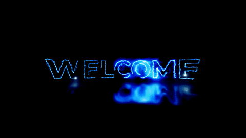

# Hi, I'm Nexus :wave:

    
  

    <b>Software engineering student and aspiring software entrepreneur  
                    interested in building fun, interactive, and beautiful experiences  
                              for the Web (graphics ◆ games ◆ websites ◆ creative coding).

Obsessed with performance and clean code.
       
</b>

## Life

:shipit: Student Member @ 
https://www.cursoemvideo.com/

:shipit: Cyber Security @ 
https://discord.com/invite/kXbCc3WwvC/

:shipit: Developer community Br @ 
https://discord.gg/code-help-1094407116946685992

:shipit: Friend Programmer @ 
https://www.linkedin.com/in/helber-cardoso-a11a53216/

## Skills

_Favorite programming language: JavaScript :crab:._  
_Fun tidbits: My side interests are :paintbrush: graphics design, :man_dancing:
breakdancing, and :skateboard: skateboarding._

### Software

    <b>Looking for a software engineering intern?
        <a href="https://www.linkedin.com/in/marcos-vinicius-86706b262/">Let's connect and talk!</a>
    </b>

---

<!---->

 

